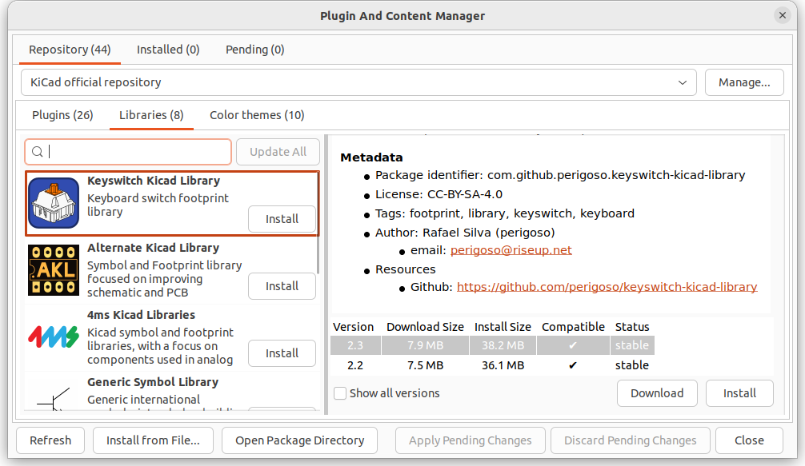

# Keycap Ruler

Sometimes I find it hard to tell the exact size of a keycap, especially the larger ones that I don't use much. E.g.: 1.75U or 2.75U. There are "keycap rules" online, such as the excellent [Keycap Ruler by Zekth](https://zekth.github.io/keycap-ruler/). But I wanted a physical ruler I could use with keycap sets, to make my life easier.

So, I made two versions:

1. A [cheap keycap ruler](#keycap-ruler-made-with-labels), which can be made by applying sticky labels to a regular ruler.

2. A [PCB keycap ruler](#keycap-ruler-made-as-a-pcb), which can be manufactured using JLCPCB or another PCB manufacturer. It's a circuit board, although there are no actual electronics on it.

Both versions can be found in this repository, and are open source. See the section "Licence and Licensing" at the end of this document. 

There is a section below on each version of the ruler.

> [!TIP]
> I also recommend that you take a look at Technofrikus' [keyboard-unit-pcb-ruler](https://github.com/Technofrikus/keyboard-unit-pcb-ruler), which you can buy from Keeb.supply in Germany as [The Unit](https://keeb.supply/products/the-unit). As well as helping to measure keycaps, it has a lot of other cool details.

## Inspiration

Thank you to the authors of the following resources!

 * [Zekth: Keycap Ruler](https://zekth.github.io/keycap-ruler/) - including charts and sizes
 * [Keyboard University: Keycap Ruler](https://www.keyboard.university/resources/keycap-sizes-slhwl) - cheatsheet including printable ruler
 * [Dwarf Factory: Keycap Length And Things You Should Know](https://www.dwarf-factory.com/keycap-length/)

## Keycap Ruler: Made with Labels

The [keycap ruler labels](labels/keycap-ruler.odt) in this repository can be printed onto a sheet of labels. Then the labels can be cut out and stuck onto the ruler. To make it easier to understand how many labels will fit per side on a ruler, I have a [spreadsheet with calculations](labels/keycap-ruler.ods). E.g.: you can fit up to and including 2U labels on a 15 cm ruler with a 2 mm gap. (I have no tried longer rulers.)

Note that the keycap labels are designed to fit the specific adhesive labels I used (see below). The text boxes in the LibreOffice document are set to specific positions offset to the A4 page. You will need to adjust the document if you are using a different paper size, or different label sizes.

### What You Need

 * One or more rulers
 * A sheet of labels
 * A printer

I used these items. Note: Wilko is a general store in the UK, with reasonable prices and a good selection.

 * [Wilko White Adhesive Labels](https://www.wilko.com/en-uk/wilko-white-self-adhesive-labels-210-pack/p/0261768): A4 white adhesive labels, 210 labels, 63 mm x 38 mm label size
 * [Wilko 6 inch plastic ruler](https://www.wilko.com/en-uk/wilko-6-inch-plastic-ruler/p/0260669) - 15 cm long

### Example Keycap Ruler


## Keycap Ruler: Made as a PCB

This was designed with KiCad 7.0. You'll need to use that too, to view/edit the keycap ruler. The KiCad files are in [`pcb/`](pcb/).

If you just want to order PCBs of the ruler from JLCPCB, you should be able to just use the files in [`gerbers/`](gerbers/). The Gerbers were generated using JLCPCB's instructions - you may need to re-generate them to use a different PCB manufacturer.

### What You Need

KiCad 7.0 (current at time of writing). I don't know if it will work with later version of KiCad.

You will need to use the KiCad Plugin and Content Manager to install the "Keyswitch Kicad Library". E.g.:



Once that's installed, follow the [instructions](https://github.com/perigoso/keyswitch-kicad-library#using-the-library) "[...] to add the libraries to the library table manually". Note: You will need to use `KICAD7_3RD_PARTY` instead of `KICAD6_3RD_PARTY` in the paths.

### Generating Gerber Files for JLCPCB

I followed [JLCPCB: How to generate Gerber and Drill files in KiCad 6](https://support.jlcpcb.com/article/194-how-to-generate-gerber-and-drill-files-in-kicad-6). It still seems to apply to KiCad 7.

```bash
zip -9 ../gerbers.zip *
```

and then `gerbers.zip` was uploaded to JLCPCB.

### Example PCB Keycap Ruler


## Licence and Licensing


This work is licensed under a [Creative Commons Attribution-ShareAlike 4.0 International License](http://creativecommons.org/licenses/by-sa/4.0/).
