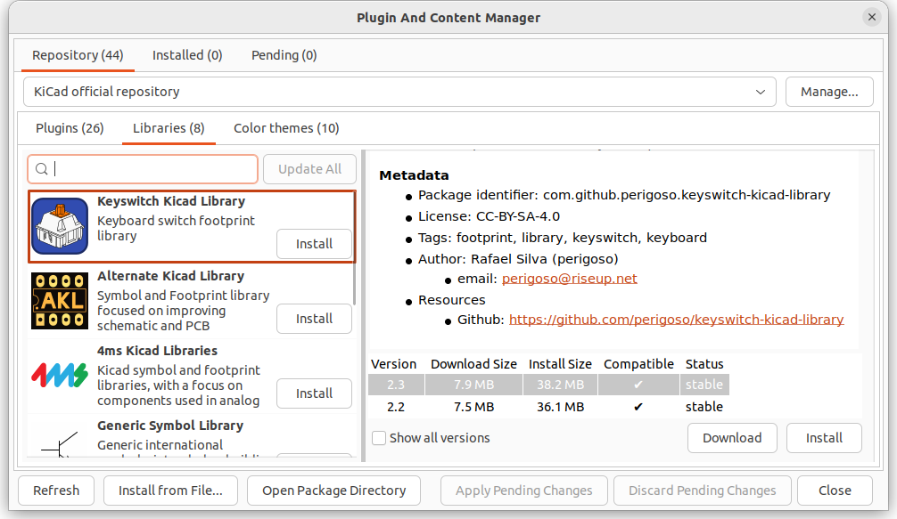

# Keycap ruler in PCB form

This was designed with KiCad 7.0. You'll need to use that too, to view/edit the keycap ruler.

You will need to use the KiCad Plugin and Content Manager to install the "Keyswitch Kicad Library". E.g.:



Once that's installed, follow the [instructions](https://github.com/perigoso/keyswitch-kicad-library#using-the-library) "[...] to add the libraries to the library table manually". Note: You will need to use `KICAD7_3RD_PARTY` instead of `KICAD6_3RD_PARTY` in the paths.

## Generating Gerber Files for JLCPCB

I followed [JLCPCB: How to generate Gerber and Drill files in KiCad 6](https://support.jlcpcb.com/article/194-how-to-generate-gerber-and-drill-files-in-kicad-6). It still seems to apply to KiCad 7.

```bash
zip -9 ../gerbers.zip *
```

and then `gerbers.zip` was uploaded to JLCPCB.